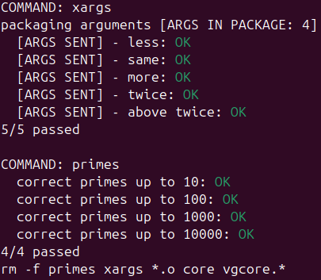

<div align="center">
  <h1>🍴 Fork</h1>

  <p>
    <strong>Sistemas Operativos (7508) - FIUBA</strong><br>
    Laboratorio sobre manejo de procesos (fork), tuberías (pipes) y descriptores de archivo en UNIX.
  </p>

  
  
  
  

  <br>

  
</div>

---

## 📋 Descripción

Este proyecto contiene la implementación de dos utilidades fundamentales para entender la concurrencia en UNIX:

1.  **`primes`**: Generador de números primos concurrentes utilizando la Criba de Eratóstenes mediante procesos enlazados por *pipes*.
2.  **`xargs`**: Implementación de la utilidad estándar que construye y ejecuta líneas de comandos a partir de la entrada estándar.

## 💻 Programas

### 1. Primes (`primes.c`)
Implementación de la Criba de Eratóstenes concurrente para generar números primos. El proceso principal genera una secuencia de números y crea una cadena de procesos filtradores conectados por *pipes*.

**Uso:**

```bash
./primes <N>
```

**Ejemplo:**

```bash
./primes 35
# Salida esperada:
# primo 2
# primo 3
# ...
# primo 31
```

### 2. Xargs (`xargs.c`)

Implementación simplificada de la utilidad estándar xargs. Lee argumentos desde la entrada estándar (stdin) y ejecuta un comando específico pasando dichos argumentos en bloques (por defecto, bloques de 4 argumentos definidos por NARGS).

**Uso:**

```bash
./xargs <comando>
```

**Ejemplo:**

```bash
# Imprime los números del 1 al 10 agrupados
seq 10 | ./xargs echo
```

## 🚀 Compilación y Desarrollo

### Compilar

**Para generar los binarios primes y xargs:**

```bash
make
```

**Limpiar binarios**

```bash
make clean
```

**Formato de código**

El proyecto utiliza clang-format para mantener el estilo de código del curso:

```bash
make format
```

## 🛠 Pruebas (Testing)

El repositorio cuenta con un sistema de pruebas automatizado en Python (tests/) que verifica tanto la lógica de los programas como el manejo de memoria con Valgrind.
Ejecutar pruebas (Docker)

La forma recomendada de correr las pruebas es utilizando el entorno Docker provisto, lo cual asegura que las herramientas necesarias (como Valgrind y Python 3) estén disponibles.

```Bash
make test
```

Esto construirá una imagen Docker llamada fisop-fork y ejecutará los tests dentro de ella.

## 👥 Integrantes

| Integrante | Padrón | Contacto |
| :--- | :---: | :---: |
| **Calderón Vasil, Máximo Augusto** | 111810 | [](https://github.com/maxivasil) [](mailto:mcalderonv@fi.uba.ar) |